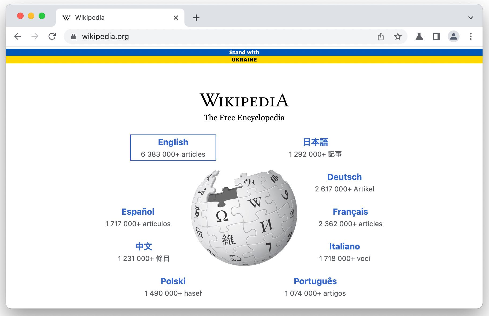

# Raise the flag 🇺🇦

The flag of Ukraine (Ukrainian: Прапор України, romanized: Prapor Ukrainy) consists of equally sized horizontal bands of blue and yellow. The combination of blue and yellow as a symbol of Ukraine comes from the flag of the Kingdom of Galicia–Volhynia used in the 12th century.



Add a banner to your web page and publicly show support and recognition to the people of Ukraine: millions of refugees, hundreds of thousands of military personnel, thousands injured and killed.

## How do I add this to my web site?

Add this code to the HTML code of your web page(s). If you need help or something doesn't work - let me know!

```
<script src="https://cdn.jsdelivr.net/npm/@mkotsur/prapor-widget@0.0.2/dist/widget.min.js"></script>
```

## Can I change the wording?

```
<script src="https://cdn.jsdelivr.net/npm/@mkotsur/prapor-widget@0.0.2/dist/widget.min.js" data-blue-text="PUTIN" data-yellow-text="KHUILO"></script>
```

## Can I remove the wording?

You can have only the flag without any words.

```
<script src="https://cdn.jsdelivr.net/npm/@mkotsur/prapor-widget@0.0.2/dist/widget.min.js" data-blue-text="" data-yellow-text=""></script>
```

## More widgets

-   Help Ukraine Widget: [https://hup.rokkido.cx.ua](https://hup.rokkido.cx.ua)
-   Help Ukraine Win Widget: [https://helpukrainewinwidget.org/](https://helpukrainewinwidget.org/)

## Other references

-   [Creating JavaScript Widgets](https://rasayel.io/blog/how-to-create-a-javascript-widget/) - Abdelrahman Awad, August 25, 2021
